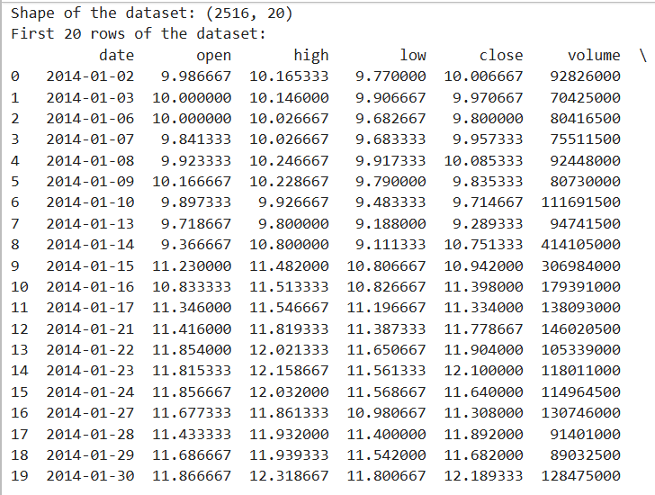
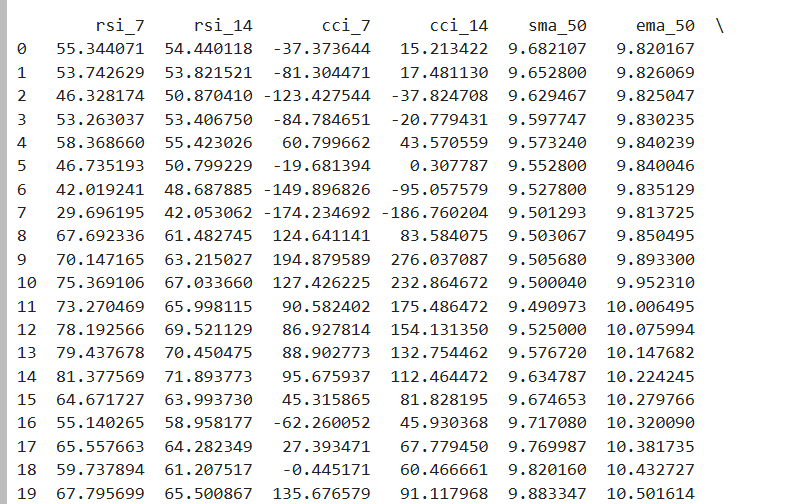
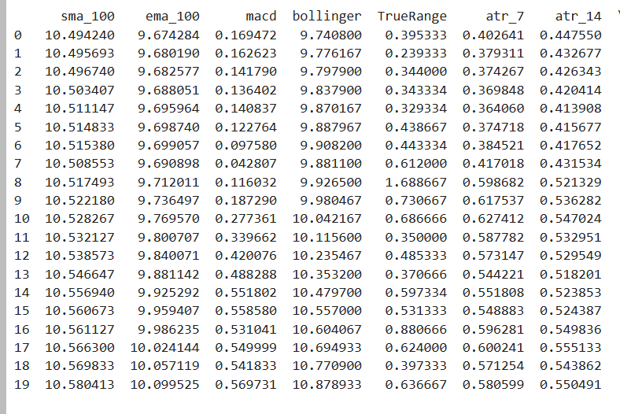
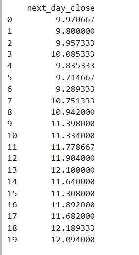
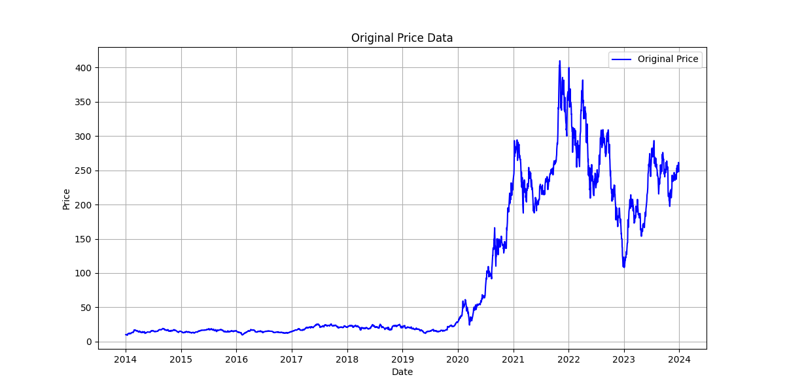
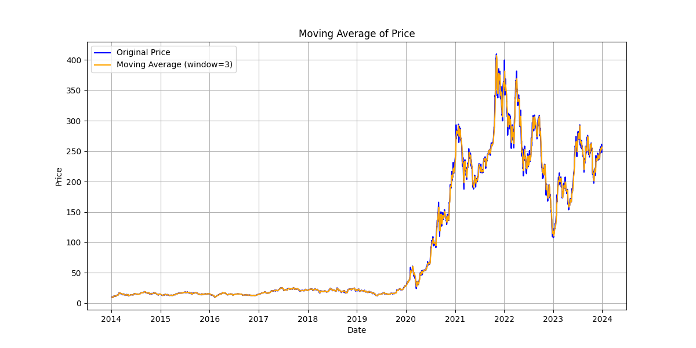
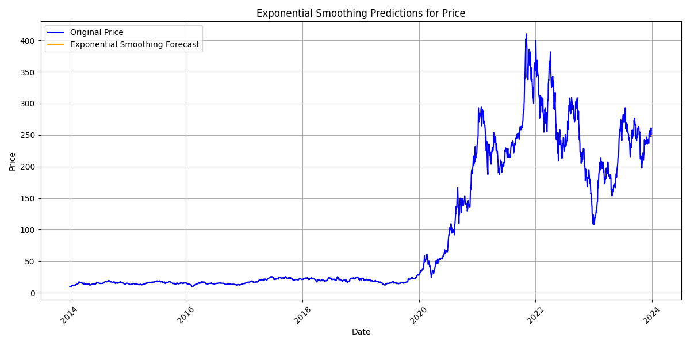

# Ex.No: 08     MOVINTG AVERAGE MODEL AND EXPONENTIAL SMOOTHING

### AIM:
To implement Moving Average Model and Exponential smoothing Using Python.
### ALGORITHM:
1. Import necessary libraries
2. Read the electricity time series data from a CSV file,Display the shape and the first 20 rows of
the dataset
3. Set the figure size for plots
4. Suppress warnings
5. Plot the first 50 values of the 'Value' column
6. Perform rolling average transformation with a window size of 5
7. Display the first 10 values of the rolling mean
8. Perform rolling average transformation with a window size of 10
9. Create a new figure for plotting,Plot the original data and fitted value
10. Show the plot
11. Also perform exponential smoothing and plot the graph
### PROGRAM:
```python
import numpy as np
import pandas as pd
import matplotlib.pyplot as plt
import warnings
from statsmodels.tsa.holtwinters import ExponentialSmoothing

# Suppress warnings
warnings.filterwarnings('ignore')

# Load the Tesla stock data from the CSV file
file_path = 'tsla_2014_2023.csv'
data = pd.read_csv(file_path)

# Display dataset shape and the first few rows
print("Shape of the dataset:", data.shape)
print("First 20 rows of the dataset:")
print(data.head(20))

# Convert 'date' column to datetime and set as index
data['date'] = pd.to_datetime(data['date'])
data.set_index('date', inplace=True)

# Ensure 'close' prices are numeric and handle NaN values
data['close'] = pd.to_numeric(data['close'], errors='coerce')
data = data.dropna()

# Plot the original price data and save as image
plt.figure(figsize=(12, 6))
plt.plot(data['close'], label='Original Price', color='blue')
plt.title('Original Price Data')
plt.xlabel('Date')
plt.ylabel('Price')
plt.legend()
plt.grid()
plt.savefig('tesla_original_price.png')
plt.show()

# Calculate 3-day rolling mean and plot with the original data
rolling_mean_3 = data['close'].rolling(window=3).mean()

plt.figure(figsize=(12, 6))
plt.plot(data['close'], label='Original Price', color='blue')
plt.plot(rolling_mean_3, label='Moving Average (window=3)', color='orange')
plt.title('Moving Average of Price')
plt.xlabel('Date')
plt.ylabel('Price')
plt.legend()
plt.grid()
plt.savefig('tesla_moving_average.png')
plt.show()

# Fit an Exponential Smoothing model with additive trend
model = ExponentialSmoothing(data['close'], trend='add', seasonal=None)
model_fit = model.fit()

# Forecast the next 5 steps
future_steps = 5
predictions = model_fit.predict(start=len(data), end=len(data) + future_steps - 1)

# Create future dates for the forecast
future_dates = pd.date_range(start=data.index[-1] + pd.Timedelta(days=1), periods=future_steps)

# Plot the forecast alongside the original data
plt.figure(figsize=(12, 6))
plt.plot(data['close'], label='Original Price', color='blue')
plt.plot(future_dates, predictions, label='Exponential Smoothing Forecast', color='orange')
plt.title('Exponential Smoothing Predictions for Price')
plt.xlabel('Date')
plt.ylabel('Price')
plt.legend()
plt.xticks(rotation=45)
plt.grid(True)
plt.tight_layout()
plt.savefig('tesla_forecast.png')
plt.show()

```
### OUTPUT:

Given Data







Moving Average



Plot Transform Dataset



Exponential Smoothing



### RESULT:
Thus we have successfully implemented the Moving Average Model and Exponential smoothing using python.
